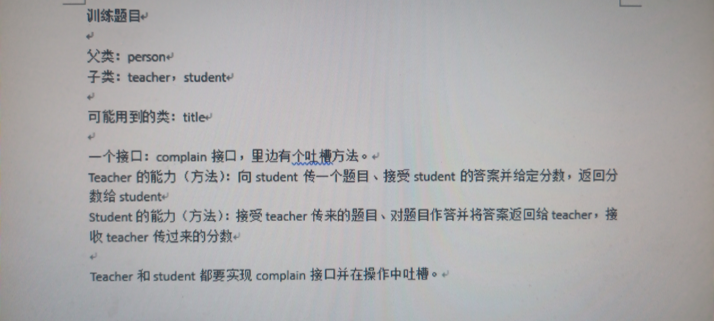

## 要求 
训练题目父类： person子类： teacher,student可能用到的类：title一个接口：complain接口，里边有个吐插方法。 Teacher的能力（方法）：向student传复制成功接受student的答案并给定分数，返回分数给student Student的能力（方法）：接受teacher传来的题目、对题目作答并将答案返回给teacher,接收teacher传过来的分数 Teacher和student都要实现complain接口并在操作中吐槽。


### 分析需求

我们需要实现以下功能：
1. **抽象类 `Person`**：作为 `Teacher` 和 `Student` 的基类，包含共同的属性和方法。
2. **接口 `Complain`**：包含一个 `complain` 方法，用于实现吐槽功能。
3. **子类 `Teacher`**：实现向学生传递题目、接受学生的答案并给定分数、返回分数给学生，并实现 `Complain` 接口。
4. **子类 `Student`**：实现接受教师传递的题目、对题目作答并将答案返回给教师、接收教师传过来的分数，并实现 `Complain` 接口。

### 设计类结构

#### 1. 接口 `Complain`

定义一个接口 `Complain`，其中包含一个 `complain` 方法。

```java
public interface Complain {
    void complain(String message);
}
```

#### 2. 抽象类 `Person`

定义一个抽象类 `Person`，作为 `Teacher` 和 `Student` 的基类，包含姓名属性。

```java
public abstract class Person implements Complain {
    protected String name;

    public Person(String name) {
        this.name = name;
    }

    public String getName() {
        return name;
    }
}
```

#### 3. 子类 `Teacher`

定义 `Teacher` 类，继承自 `Person` 并实现 `Complain` 接口。实现向学生传递题目、接受学生的答案并给定分数、返回分数给学生。

```java
public class Teacher extends Person {
    public Teacher(String name) {
        super(name);
    }

    // 向学生传递题目
    public void transmitTitle(Student student, String title) {
        student.receiveTitle(title);
        complain("终于把题目发出去了...");
    }

    // 接受学生的答案并评分
    public void gradeAnswer(Student student, String answer) {
        int score = evaluate(answer);
        student.receiveScore(score);
        complain("批改完这份作业真累...");
    }

    // 评分逻辑
    private int evaluate(String answer) {
        // 这里可以加入更复杂的评分逻辑
        return answer.equals("正确答案") ? 100 : 50;
    }

    @Override
    public void complain(String message) {
        System.out.println(getName() + ": " + message);
    }
}
```

#### 4. 子类 `Student`

定义 `Student` 类，继承自 `Person` 并实现 `Complain` 接口。实现接受教师传递的题目、对题目作答并将答案返回给教师、接收教师传过来的分数。

```java
public class Student extends Person {
    private String receivedTitle;
    private int receivedScore;

    public Student(String name) {
        super(name);
    }

    // 接收教师传递的题目
    public void receiveTitle(String title) {
        this.receivedTitle = title;
        complain("终于拿到题目了...");
    }

    // 对题目作答并将答案返回给教师
    public void submitAnswer(String answer) {
        // 这里可以加入更复杂的答题逻辑
        complain("终于写完了...");
        // 假设这里有一个假定的答案
        Teacher teacher = new Teacher("Mr. Wang");
        teacher.gradeAnswer(this, answer);
    }

    // 接收教师传过来的分数
    public void receiveScore(int score) {
        this.receivedScore = score;
        complain("看到分数了...");
    }

    public int getReceivedScore() {
        return receivedScore;
    }

    @Override
    public void complain(String message) {
        System.out.println(getName() + ": " + message);
    }
}
```

### 测试类 `TestApp`

编写一个测试类 `TestApp`，用于演示 `Teacher` 和 `Student` 类的功能。

```java
public class TestApp {
    public static void main(String[] args) {
        Teacher teacher = new Teacher("Mr. Wang");
        Student student = new Student("Tom");

        // 教师向学生传递题目
        teacher.transmitTitle(student, "这是一个测试题目...");

        // 学生答题并提交答案
        student.submitAnswer("正确答案");

        // 输出学生的分数
        System.out.println(student.getName() + "的成绩是：" + student.getReceivedScore() + "分");
    }
}
```

### 分析过程

1. **定义接口**：
   - 我们定义了一个接口 `Complain`，其中包含一个 `complain` 方法，用于实现吐槽功能。

2. **定义抽象类**：
   - 我们定义了一个抽象类 `Person`，作为 `Teacher` 和 `Student` 的基类，包含姓名属性。

3. **定义子类**：
   - 我们定义了 `Teacher` 类，实现了向学生传递题目、接受学生的答案并给定分数、返回分数给学生，并实现了 `Complain` 接口。
   - 我们定义了 `Student` 类，实现了接受教师传递的题目、对题目作答并将答案返回给教师、接收教师传过来的分数，并实现了 `Complain` 接口。

4. **编写测试类**：
   - 我们编写了一个测试类 `TestApp`，用于演示 `Teacher` 和 `Student` 类的功能。

### 运行程序

确保将上述类分别保存到不同的文件中：

1. `Complain.java`
2. `Person.java`
3. `Teacher.java`
4. `Student.java`
5. `TestApp.java`

然后在命令行中编译这些类：

```sh
javac Complain.java Person.java Teacher.java Student.java TestApp.java
```

编译完成后，运行 `TestApp` 类：

```sh
java TestApp
```

输出结果应该如下：

```
Mr. Wang: 终于把题目发出去了...
Tom: 终于拿到题目了...
Tom: 终于写完了...
Mr. Wang: 批改完这份作业真累...
Tom: 看到分数了...
Tom的成绩是：100分
```


好的，这里是完整的可运行代码，包括接口 `Complain`、抽象类 `Person`、子类 `Teacher` 和 `Student`，以及测试类 `TestApp`。

### 接口 `Complain`

```java
public interface Complain {
    void complain(String message);
}
```

### 抽象类 `Person`

```java
public abstract class Person implements Complain {
    protected String name;

    public Person(String name) {
        this.name = name;
    }

    public String getName() {
        return name;
    }
}
```

### 子类 `Teacher`

```java
public class Teacher extends Person {
    public Teacher(String name) {
        super(name);
    }

    // 向学生传递题目
    public void transmitTitle(Student student, String title) {
        student.receiveTitle(title);
        complain("终于把题目发出去了...");
    }

    // 接受学生的答案并评分
    public void gradeAnswer(Student student, String answer) {
        int score = evaluate(answer);
        student.receiveScore(score);
        complain("批改完这份作业真累...");
    }

    // 评分逻辑
    private int evaluate(String answer) {
        // 这里可以加入更复杂的评分逻辑
        return answer.equals("正确答案") ? 100 : 50;
    }

    @Override
    public void complain(String message) {
        System.out.println(getName() + ": " + message);
    }
}
```

### 子类 `Student`

```java
public class Student extends Person {
    private String receivedTitle;
    private int receivedScore;

    public Student(String name) {
        super(name);
    }

    // 接收教师传递的题目
    public void receiveTitle(String title) {
        this.receivedTitle = title;
        complain("终于拿到题目了...");
    }

    // 对题目作答并将答案返回给教师
    public void submitAnswer(String answer) {
        // 这里可以加入更复杂的答题逻辑
        complain("终于写完了...");
        // 假设这里有一个假定的答案
        Teacher teacher = new Teacher("Mr. Wang");
        teacher.gradeAnswer(this, answer);
    }

    // 接收教师传过来的分数
    public void receiveScore(int score) {
        this.receivedScore = score;
        complain("看到分数了...");
    }

    public int getReceivedScore() {
        return receivedScore;
    }

    @Override
    public void complain(String message) {
        System.out.println(getName() + ": " + message);
    }
}
```

### 测试类 `TestApp`

```java
public class TestApp {
    public static void main(String[] args) {
        Teacher teacher = new Teacher("Mr. Wang");
        Student student = new Student("Tom");

        // 教师向学生传递题目
        teacher.transmitTitle(student, "这是一个测试题目...");

        // 学生答题并提交答案
        student.submitAnswer("正确答案");

        // 输出学生的分数
        System.out.println(student.getName() + "的成绩是：" + student.getReceivedScore() + "分");
    }
}
```

### 运行步骤

1. **保存文件**：
   - 将 `Complain.java`、`Person.java`、`Teacher.java`、`Student.java` 和 `TestApp.java` 分别保存为对应的文件名。

2. **编译文件**：
   - 在命令行中编译这些类：
     ```sh
     javac Complain.java Person.java Teacher.java Student.java TestApp.java
     ```

3. **运行测试类**：
   - 运行 `TestApp` 类：
     ```sh
     java TestApp
     ```

### 运行结果

运行后，控制台输出应该如下：

```
Mr. Wang: 终于把题目发出去了...
Tom: 终于拿到题目了...
Tom: 终于写完了...
Mr. Wang: 批改完这份作业真累...
Tom: 看到分数了...
Tom的成绩是：100分
```
